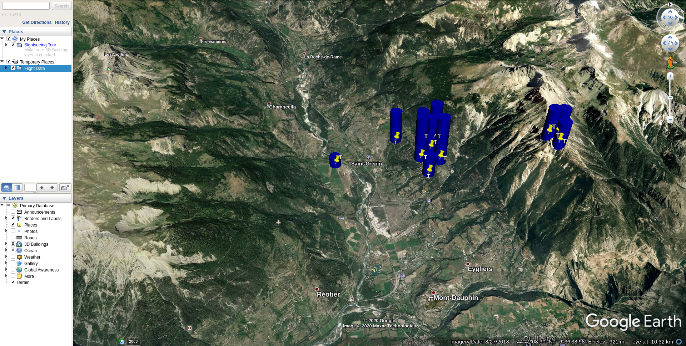

# IGCAnalyse

The program tries to extract average circling positions
from igc files. These positions may be close to thermals.

Some results for the PACA region in France:

(These files only contain the 177 most common positions found in about 1GB of data)

[cup file](results/res.cup)

[kmz file](results/res.kmz)




# Usage

Compile using maven:
```
mvn package
```

Run:
```
java -jar target/igcanalyse-[version].jar [options]
```

Options:
```
-h
--help             display help screen

-i <str>           set the path that contains the flight logs

--max-count <int>  set the maximum number of thermals to keep
--min <int>        set the minimum amount of times a thermal has been found to be kept
--cup <str>        set the output file for the cup file (if not set no cup file will be written
--kml <str>        set the output file for the kml file (if not set no kml file will be written
--load <str>       expects a path to a cup file containing thermals. This has to
                   be a file written by this program or else it will fail
                   (note: errors will not be handled well)
                   So if you use this option be careful only to use non-modified cup
                   files written only by this program
```

The `-i` options sets the path where the igc flight data is located. The path
will be recursively walked through and every igc file inside the path will
be analyzed.

The `--max-count` option sets the maximum number of thermals to keep in the result
file and the `--min` option sets the minimum number of times a thermal has to be merged
to be kept in the result file.

The results are written to the files given with the options `--cup` and `--kml`. The `res.cup` file
can be used with a gps and the `res.kml` file can be opened with Google Earth.
Note that the `res.kml` file requires the `cylinder.dae` file that can be found
int the `results` directory to be in the same folder.

Both files can also be zipped together into a single file and then by changing
the extension from `.zip` to `.kmz` the file can be opened with Google Earth
without needing to keep track of 2 files.